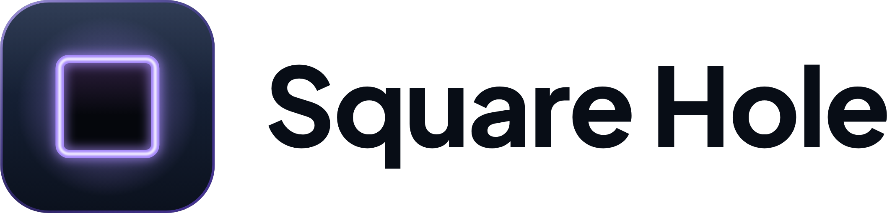

<p align="center">
  <picture>
    <source media="(prefers-color-scheme: dark)" srcset="logo/png/square-hole-lockup-horizontal@2x.png">
    
  </picture>
</p>

# Square Hole brand kit

The name, mark, colours, type and voice of Square Hole, plus the FIT token icon and the images for GitHub. Everything
here may be used to refer to Square Hole; read [NOTICE.md](NOTICE.md) first. The review sheet
[`logo/preview.png`](logo/preview.png) shows every export on the brand surfaces and on white.

## Name and taglines

- **Square Hole**: two words, capital S and H. Not "SquareHole", "Squarehole" or "SQUARE HOLE" in running text.
  Domains and handles are lower case: `squarehole.fun`, `squarehole.xyz`, `squarehole.fit`.
- **FIT** is the token. Write "FIT"; "$FIT" only as a cashtag in running text, never on the icon.
- Taglines, in sentence case with both full stops:
  - **"Different shapes. Same hole."** (primary)
  - **"Many shapes. One hole."** (alternate, for variety; do not use both in one place)

The joke is the brand: in the toy, only the cube belongs in the square hole, and here every shape goes in anyway.

## The mark

A rounded navy tile with a square hole whose lip glows lavender. The hole is axis-aligned and centred, and it is
40.6% of the tile, the same share as the hole in the FIT coin.

| File (`logo/svg/`) | What it is | Use it for |
|---|---|---|
| `square-hole-mark.svg` | Full colour master, 256 grid (gradients, glow) | Anything 48 px and larger |
| `square-hole-mark-16.svg`, `-24.svg`, `-32.svg` | Flat drawings hinted to whole pixels | Exactly 16, 24 and 32 px |
| `square-hole-app-icon.svg` | The tile's face as a full square (the platform rounds it) | App icons, avatars |
| `square-hole-mark-flat.svg` | One colour, lavender `#A78BFA`, the hole cut out | Flat print, stickers, one-colour UI on dark |
| `square-hole-mark-mono.svg` | One colour, `currentColor`, the hole cut out | Navy on white, white on photos or on violet |
| `square-hole-lockup-horizontal*.svg` | Mark + wordmark side by side | Headers, footers, banners |
| `square-hole-lockup-stacked*.svg` | Mark above the wordmark | Square spaces, splash screens |
| `square-hole-wordmark*.svg` | The wordmark alone | Only where the mark is already on screen |

Lockups and wordmarks come in three variants: no suffix (for dark backgrounds, white text), `-on-light` (navy text)
and `-mono` (`currentColor`). The wordmark is outlined, so no font is needed to show it.

PNG exports with real alpha are in `logo/png/`: the mark at 16, 24, 32, 48, 64, 128, 256, 512 and 1024 px, the flat
and mono marks, and every lockup at 1× and 2×. **Use the PNG made for the size you show.** Do not scale the 1024 px
file down to 16–32 px; the glow blurs into the hole there. For a size in between, round up to the next export.

### Clear space and minimum sizes

- **Clear space:** one quarter of the mark's side on every side (16 px around a 64 px mark). For lockups, measure it
  from the mark's height. The gap between mark and wordmark in the horizontal lockup is that same quarter.
- **Minimum sizes:** mark 16 px (use the 16 px drawing); horizontal lockup 32 px tall; stacked lockup 96 px wide;
  wordmark alone 16 px tall. Below these the wordmark's capitals drop under 12 px.

### Favicon and app icons (`logo/favicon/`)

```html
<link rel="icon" href="/favicon.ico" sizes="32x32">
<link rel="icon" href="/favicon.svg" type="image/svg+xml">
<link rel="apple-touch-icon" href="/apple-touch-icon.png">
<link rel="manifest" href="/site.webmanifest">
```

`favicon.ico` holds the 16, 32 and 48 px exports. `apple-touch-icon.png` (180) and `icon-maskable-512.png` are opaque
full squares for the platform to round; the hole stays inside the maskable 80% safe zone. `icon-192.png` and
`icon-512.png` keep transparent corners.

## Colours

Dark theme first: navy canvas, lavender hole, white text. Full tokens, CSS variables and computed contrast are in
[`colors/`](colors/README.md).

| Lavender | Violet | Navy | Surface | Raised | Text | Secondary | Glow |
|---|---|---|---|---|---|---|---|
| `#A78BFA` | `#6D4AE2` | `#080D16` | `#111B29` | `#18253A` | `#F3F5FB` | `#B5C0D5` | `#C4B2FF` |

Lavender is the brand colour (7.15:1 on navy). Violet is a button fill with white text, never text on dark. Green, red
and yellow are UI states only and stay out of brand art.

## Typography

**Plus Jakarta Sans** (OFL-1.1). Wordmark 750 with -0.02 em tracking, headings 700–750, taglines 550, body 400,
labels 700 in uppercase with +0.14 em tracking. Details in [`typography/`](typography/README.md). No font file is in
this repository.

## Voice

Plain, short and friendly. Playful about shapes, sober about money. Say what the software does, never what anyone
will get from it.

**Safe wording rules** (they apply everywhere: site, posts, images, alt text):

- No yield, return (in the money sense), earn, profit, income, gains, interest, dividend, APY, APR or ROI.
- No "investment", "opportunity", "guaranteed", "risk-free", "backed value", "to the moon", no price talk.
- No urgency or fear of missing out: "get in early", "last chance", "don't miss out".
- No gambling words for draws: no "jackpot", "lottery", "win", "prize". A draw is a draw.
- No "buy now" or other trading calls to action in brand material.
- Screenshots with mock data keep their "Demo" label.
- A logo never proves identity. Wherever the mark or the FIT icon appears next to a token or collection, the page
  also shows the chain and the contract address.

| Say | Do not say |
|---|---|
| "Swap FIT for an NFT from the box." | "Earn a rare NFT." |
| "Draw fees are burned." | "Burns make your FIT worth more." |
| "Every box works the same way." | "Backed by real value." |
| "Square Hole is in development." | "Launching soon, get in early." |
| "Read the terms before you use the app." | "Not financial advice, but …" |

## Don'ts

- **No gold FIT.** The FIT coin is lavender only. The gold coin is a character, not the token.
- **No Misfit inside the FIT coin**, and no character, face, star or other shape in or on the coin or the mark.
- **No currency signs** ($, ₿, Ξ, ¢, €, ¥), letters or numbers on the mark or the coin.
- **No brand look-alikes.** Do not redraw the mark so it resembles another company's logo: an outlined tile with a
  solid square in the middle reads as a payments brand, and a square next to a circle, triangle and cross reads as a
  games console. Do not place the mark beside other projects' logos in a way that suggests a partnership.
- **Keep the mark and the coin apart.** Never put the FIT coin inside the platform tile; they share the hole, not
  the shape.
- Do not rotate, skew or stretch the mark; the hole stays axis-aligned and centred.
- Do not recolour it outside the flat and mono files, and add no outline, drop shadow or extra outer glow.
- Do not set the full-colour mark on busy photos; use the white mono mark.
- Do not retype the wordmark in another font, weight or spacing.
- Do not use the mark as a "stop" button or any other control.
- Brand material never shows unreleased collection art or contract details that are not public.

## GitHub (`github/`, `dotgithub/`)

- `org-avatar-500.png`: organisation profile picture.
- `social-preview-code-1280x640.png` and `social-preview-branding-1280x640.png`: each repository's social preview
  (under 1 MB, content inside the 1.91:1 crop that link cards use).
- `profile-banner.png` (1600 × 400): the banner of the organisation's profile README.
- `dotgithub/`: the content of the organisation's public `.github` repository (see its README).

## FIT token icon (`fit/`)

A verbatim copy of the FIT icon set from the Square Hole code repository, with its own README (which files to use at
which size, geometry, contrast, don'ts) and `manifest.json` (sha256 of every file). Paths in `fit/README.md` refer to
the code repository.

## Rebuilding

The hand-authored sources are `logo/svg/square-hole-mark*.svg`, `logo/svg/square-hole-app-icon.svg` and
`colors/tokens.json`. Everything else is generated, and `manifest.json` lists the size and sha256 of every generated
file.

```sh
node scripts/build.mjs            # SVG lockups, PNGs, favicons, GitHub images, logo/preview.png, manifest.json
node scripts/build.mjs --check    # renders in memory and compares with manifest.json
node scripts/tokens.mjs [--check] # colors/tokens.css and the contrast table in colors/README.md
python3 scripts/outline_text.py [--check]   # only when a brand text changes: src/text-paths.json
```

- Node 24 and Playwright 1.63.0's Chromium (pinned in `package.json`; `pnpm install` and
  `pnpm exec playwright install chromium` here, or set `SQUAREHOLE_REPO` to a Square Hole code checkout, whose app
  pins the same version). A different Chromium build may change PNG bytes: review `logo/preview.png` before
  committing new hashes.
- Outlining needs Python 3 with fontTools (4.51.0 used) and brotli, the HarfBuzz `hb-shape` tool (14.2.0 used) and
  `@fontsource-variable/plus-jakarta-sans@5.3.0` (checked by sha256).
